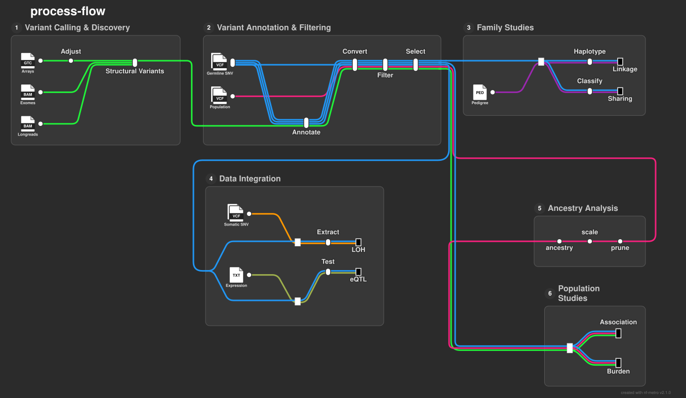

## **genomictools**: a suite of workflows for scalable genomics data analysis

### Summary

To analyze genomics data at scale, the use of workflow systems and specialized tools is often needed.
Most tools are very generic and can be used for different purposes. Others are very specialized
and require specific configurations. In both cases, analysis decisions and choice of parameters can be
exacting, since these are often particular to the type of analysis and depends on the dataset.
In addition multiple steps are often required to resize, reshape and filter the data for the 
different tools. As a result, composing pipelines for the common data analysis tasks becomes more
challenging. 

### Approach

We aim to fill in the current gap by creating modular workflows for routine genomic data
analysis tasks. These workflows are:

1. **Scalable** with respect to data size and when possible across data types
2. **Modular** design that can be adapted to different use cases
3. **Intuitive** code that relates the analysis choices and steps to the workflow parameters

This approach removes the main pain points, enhances reproducibility, and makes teaching genomics easier.

### Implementation

The workflows are written in `Nextflow` which handles the allocation of resources and the execution
software environments/containers. In addition, `Nextflow` allows for parallel execution of processes
which are written to be applied to small chunks of data.

The code of each pipeline is organized in four layers:

- _bin_: contains scripts that execute a specific step of the analysis. These are mainly in `bash`, `python` and `R` 
- _modules_: calls the scripts and handles the inputs and outputs
- _subworkflows_: calls multiple modules to accomplish a specific task
- _main.nf_: orchestrates the subworkflows, takes inputs, performs the analysis steps and produces the output

Configuration files go into `conf/`. The `nextflow.config` file contains basic configurations and default 
parameters, which can be overridden via command-line parameters or a `params.json` configuration file.

When possible, a unified CSV input file is used across the different workflows to maintain consistency.

### Workflows

#### 1. Variant Calling & Discovery
- **call-cnv-consensus**: Call copy number variants from microarray data using PennCNV, QuantiSNP, and RGADA
- **call-cnv-exome**: Call CNVs from whole exome sequencing data
- **call-sv-longreads**: Call structural variants from long-read sequencing data

#### 2. Variant Annotation & Filtering
- **annotate-vcf-variants**: Annotate VCF variants using multiple tools (VEP, SpliceAI, Pangolin, AlphaGenome, atSNP, DeepMVP)
- **select-cohort-variants**: Filter and select variants by functional class, frequency, and quality metrics

#### 3. Family Studies
- **identify-family-linkage**: Identify genetic linkage in families using parametric and non-parametric tests
- **identify-family-sharing**: Identify shared variants and regions in families
- **identify-individuals-ibd**: Detect identity-by-descent segments between individuals

#### 4. Data Integration
- **quantify-trait-loci**: Map expression quantitative trait loci (eQTLs) from expression data
- **infer-heterozygosity-loss**: Detect runs of homozygosity and loss of heterozygosity regions

#### 5. Ancestry Analysis
- **infer-cohort-ancestry**: Infer population ancestry using principal component analysis

#### 6. Population & Association Analysis
- **identify-associated-loci**: Identify genome-wide significant loci from association studies
- **test-gene-burden**: Perform gene-level burden testing for rare variants
- **tabulate-population-controls**: Compute allele frequency tables from control populations

### Shared Components

- **bin/**: Shared utility scripts in R, Python, and Bash
- **modules/**: Shared Nextflow modules for common tasks (included as Git submodule)
- **subworkflows/**: Shared Nextflow subworkflows for modular analysis (included as Git submodule)
- **conf/**: Shared pipeline configuration files (included as Git submodule)
- **test-datasets/**: Test data repositories for workflow validation

### Testing

Workflows are tested using representative test datasets in the `test-datasets/` directory. Each workflow 
includes `test-params.json` and `test-submit.sh` files that obtain and run the workflow on test data.
Test profiles are defined in each workflow's `nextflow.config` for quick validation.

### Contributing

Each workflow is independently documented with its own README outlining:
- Workflow purpose and design
- Input requirements and parameter options
- Output structure and file descriptions
- Usage examples

Issues and pull requests are welcomed. Please refer to individual workflow repositories for contribution guidelines.
