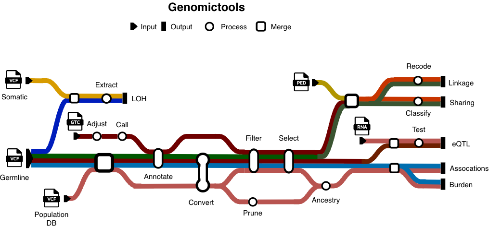

## **genomictools**: a suite of worfkows for scalable genomics data analysis. 

### Summary

To analyze genomics data at scale, the use of workflow systems and specialized tools is often needed.
Most tools are very generic and can be used for different purposes. Others are very specialized
and require specific configurations. In both cases, analysis decisions and choice of parameters can be
exacting, since these are often particular to the type of analysis and depends on the dataset.
In addition multiple steps are often required to resize, reshape and filter the data for the 
different tools. As a result, composing pipelines for the common data analysis tasks becomes more
challenging. 

### Approach

We aim to fill in the current gap by creating modular workflows for the routine genomics data
analysis tasks. These workflows are:

1. **Scalable** with respect to data size and when possible across data types
2. **Modular** design that can be adapted to different use cases
3. **Intutitve** code that relates the analysis choices and steps to the workflow parameters

This approach removes the main pain points, enhances reproduciblity, and make teaching genomics easier.

### Implementation

The workflows are written in `Nextflow` which handles the allocation of resources and the execution
software environments/containers. In addition, `Nextflow` allowes for parallel execution of processes
which are written to be applied to small chuncks of data.

The code of each pipeline is organized in four layers

- _bin_: contain scripts that excute a specific step of the analysis. These are mainly in `bash`, `python` and `R` 
- _modules_: calls the scripts and handles the inputs and outputs
- _subworkflow_: calls multiple modules
- _workflow_: takes the inputs, performs the steps and produces the analysis output

In addition, the configuration of the execution environments go into `conf/`. `nextflow.config`
contains the basic configurations and default parameters. A `params.json` file can then be used to
apply the pipeline with specific inputs and parameters.

Finally, when possible, a unified input csv file is used across the different workflows.

### Workflows

- Variant association
  - select-cohort-variants
  - test-gene-burden
  - identify-associated-loci
  - infer-cohort-ancestry
  
- Family studies
  - identify-family-linkage
  - identify-family-sharing

- Data processing
  - annotate-vcf-variants
  - demultiplex-bcl-files 
  - call-cnv-consensus
  - download-source-files
 
- Data integeration
  - infer-heterozygosity-loss
  - quantify-trait-loci

### Testing

Currently, the workflows are tested using `test-data` that are typical of their target inputs. 
`test-params.josn` and `test-submit.sh` obtain and call the workflow on the test dataset.

### Contributing

Each workflow is hosted in a separate repo, with `bin/`, `modules/` and `subworkflows/` as submodules.
In addition, `conf/` is its own submodule. Issues and pull requests are welcomed.
